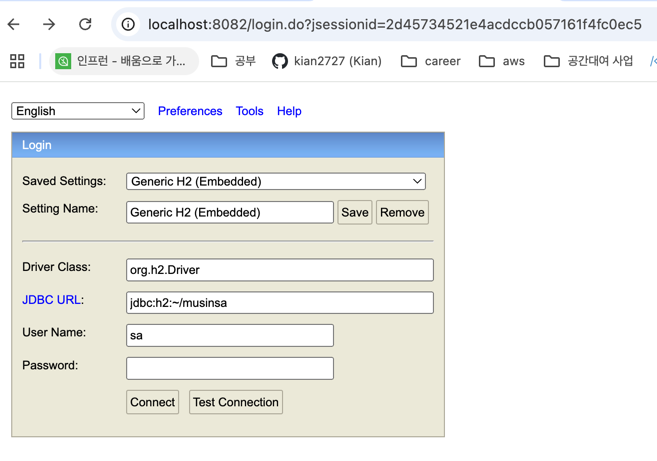

## 구현범위
### 상품 등록/수정/삭제
상품을 등록/수정/삭제하는 경우에는 관리자 권한이 필요 ( ```Headers.isAdmin = true``` 필요 )
``` 
curl --location 'http://localhost:8080/api/v1/products'
--header 'isAdmin: true' // 관리자 권한 체크
--header 'Content-Type: application/json' 
--data '{
    "brand": "AB",
    "category": "TOP",
    "price" : 1000
}'
```
   1. 상품등록 ( ```POST /api/v1/products```)
      - **Request body**
         ```json
             {
               "brand": "A",
               "category": "TOP",
               "price" : 1000
            }
          ```
      - **Response body**
         ```json
         // 성공
         {
            "id": 1
         }
      
         // 실패
         {
            "message": "이미 존재하는 brand , category 입니다. [brand = A, category = TOP]"
         }
         ```
   2. 상품수정( ```PUT /api/v1/products/{product_id}```)
      - **Request body**
         ```json
             {
               "brand": "B",
               "category": "PANTS",
               "price" : 2000
            }
          ```
      - **Response body**
         ```json
         // 성공
         {
            "id": 1,
            "brand": "B",
            "category": "PANTS",
            "price" : 2000
         }
      
         // 실패
         {
            "message": "이미 존재하는 brand , category 입니다. [brand = A, category = TOP]"
         }
         ```
2. 상품삭제( ```DELETE /api/v1/products/{product_id}```)
   - **Response body**
      ```json
      // 성공
   
      // 실패
      {
       "message": "해당 물품이 존재 하지 않습니다. [id=4]",
      }
      ```
## 코드 빌드 
## 코드 테스트
## 실행방법
## etc
- H2 설정
1. `db/h2/bin` 에있는 `h2.sh` 실행 (운영환경에따라서)
2. 실행 후 자동으로 열리는 창에서 ip를 localhost로 변경후 접속, 이후 `JDBC URL` 값을 `jdbc:h2:~/musinsa` 변경후 connect, root

홈 디렉토리에서 `musinsa.mv.db` 파일 생성 확인
3. 이후 동일하게 `h2.sh` 실행해서 `JDBC URL` 값을 `jdbc:h2:tcp://localhost/~/musinsa` 변경후 접속
